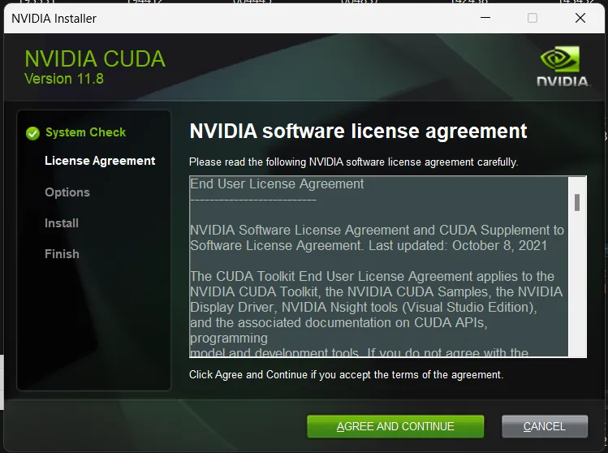
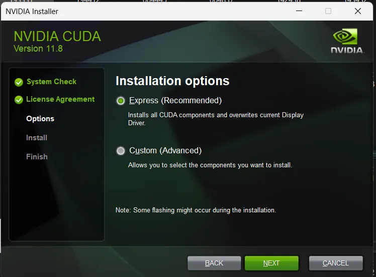
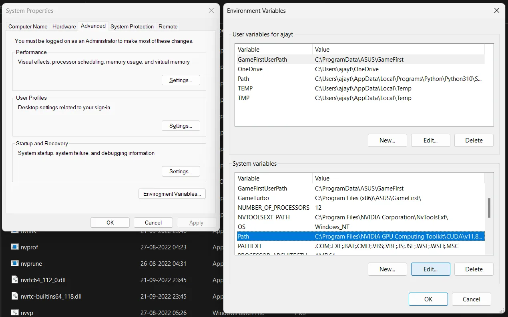
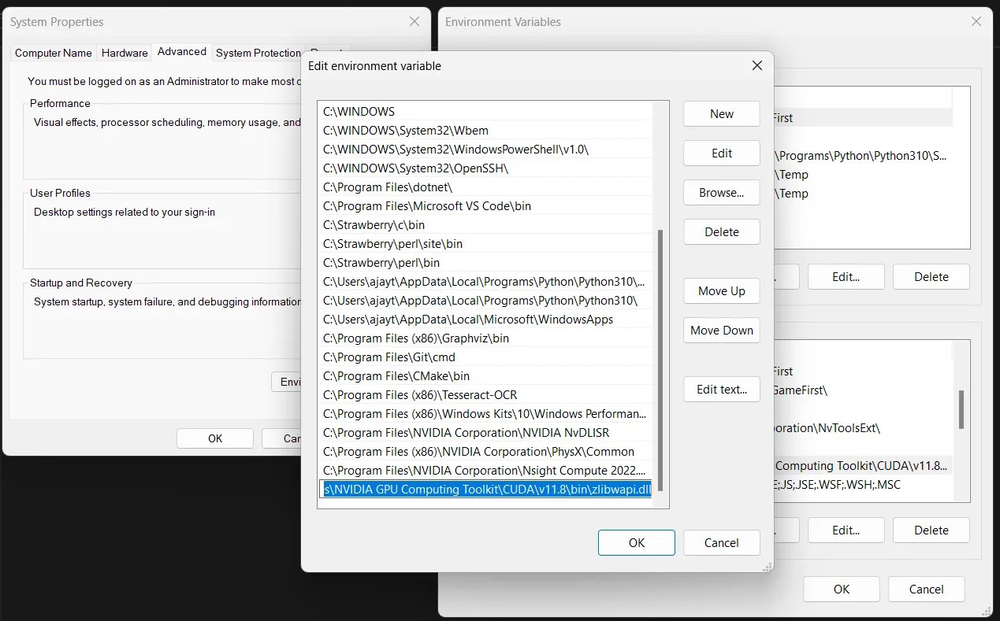

Read on [Medium](https://medium.com/@ajaytshaju/how-to-use-tensorflow-with-gpu-on-windows-for-heavy-tasks-2024-a1536448b0fe)

In the last blog [“How to use TensorFlow with GPU on Windows for minimal tasks — in the most simple way(2024)”](https://medium.com/@ajaytshaju/how-to-use-gpu-with-tensorflow-on-windows-b1726a28ab3d) I discussed how to use Microsoft TensorFlow-DirectML Plugin to make GPU available to TensorFlow(TF) in Windows, it is good for lightweight programming tasks that requiring GPU, but not good for programs that take too much graphics memory and requires heavy loading(as these frameworks need drivers and applications like CUDA and cuDNN to allocate memory for processing the data and task). So in this blog, we are going to deal with downloading and installing the correct versions of TensorFlow, CUDA, cuDNN, Visual Studio Integration, and other driver files to make GPU accessible to TensorFlow, for doing heavy tasks like Video Processing, High-Resolution Image Processing, and Deep Learning*.

<!-- truncate -->

* _These tasks are heavily dependent on your GPU type and VRAM available._

Be informed:

* The last version of TensorFlow that supports GPU on Windows is TF-2.10 (it supports most of the functionalities but it’s good to use the latest and stable versions).

* This tutorial is mainly for Windows 11 users(as most Win11 will have hardware with a supported compute version for Nvidia Apps and Drivers).

* All these downloads (especially the Visual Studio integration items) will take a good amount of secondary memory, so make sure you have about 30GB(approximate) of free memory on your computer.

* This blog will be an easy-to-understand walkthrough of directions given in TensorFlow Website and is intended for those who know only TensorFlow or like to code in TensorFlow. There is another deep learning framework named PyTorch, which is also an easy-to-use with support for GPU.


TF Caution shown on TF Website

Now we are going to do the _“Initial Checks, Download TensorFlow, Cleanup, Downloading other items, Installing the downloaded items one by one, Adding to Path, Testing, and we are done…”_

## Processes

### 1. Initial Checks

To make sure you have a physical GPU in our system that can be detected by your system, use the command `wmic path win32_videocontroller get caption` in your command prompt. Open the command prompt, Click Windows Icons → type ‘cmd’ and open the command prompt.


List of all available GPUs in your system

If this command is giving an error, check if your device manager is listing the physical GPU by, Right click on the Windows icon → device manager → drop-down Display Adapters. If GPU is not listed, see other drop-downs and see other option on the internet.

### 2. Downloading TensorFlow

You will need `TensorFlow 2.10` for this, and you can download it using `pip install tensorflow==2.10`. _Read the below paragraph before sudden action._

If you have gone through my [last blog](https://medium.com/@ajaytshaju/how-to-use-gpu-with-tensorflow-on-windows-b1726a28ab3d) to make TF work with GPU, then you will have TF CPU 2.10 and other plugins as well, but here we need normal TF 2.10. You can either start a venv(refer to [this](https://medium.com/@ajaytshaju/how-to-make-a-virtual-environment-in-python-windows-17a30b67d3bc)) or you can install TF for the user. I suggest starting with venv because it doesn’t interfere with other libraries and their dependencies while installation, also if the steps explained in this blog have completely worked out for you, you just need to take a little time to install TF for the user(if you want TF to use GPU wherever you create code files in your computer, without the need of activating a venv).

If you are installing TF for the user, there is an additional step. Go to cmd, Click Windows Icons → type ‘cmd’ and open the command prompt, now type `pip list | findstr tensorflow`. To find package names with string ‘tensorflow’. You have to uninstall all packages listed using the pip command above. Also to make sure there are no other TF components, use `pip list` to list all the packages and manually go through the list to find any TF items, if you find any, uninstall it using the name shown in the list (`pip uninstall <package-name>`). Finally, install TF using `pip install tensorflow==2.10` and you will get something like

.webp)

List of TF packages after installing TF(I have installed for the user)

### 3. Cleanup/Uninstalling

Here we do everything fresh, but you can opt for resuming from any kind of installation you have done, else if you are ready to start from scratch then go to your computer’s Settings → Apps → Installed Apps → Search ‘Nvidia’.


Installed Nvidia Apps

You can see something like this on your application list, you can uninstall every one of it safely, except the Nvidia Control Panel. If you haven’t installed any Nvidia components this list might be empty. _These uninstalls may take some time and multiple restarts, don’t worry._

### 4. Downloading Other Items

After all the uninstalls and a fresh restart, you are good to go for downloading all the required files one by one. This hack will help you install them faster. While this process may not go in a linear fashion, it will save a whole lot of time. _We’re trying parallel downloading here._

First lets start with the downloading of Nvidia latest driver for your GPU and GeForce Experience App. For this go to [this site](https://www.nvidia.com/en-us/drivers/), and you will see something like


Nvidia Driver Search


Resultant Driver after giving specifications

Download this driver and keep it in your downloads folder we will install it later. While Nvidia Driver is downloading, move to download the CUDA toolkit from [this site](https://developer.nvidia.com/cuda-11-8-0-download-archive?target_os=Windows&target_arch=x86_64&target_version=11&target_type=exe_network).


CUDA 11.8 Download Website

In the _Installer Type_, you have two options ‘local’ or ‘network’. Local means you have to download a big package of about 3-4GB and do not need an internet connection for installation. In the Network installer, your initial download size is only 30MB but during installation, it will download and install the 3-4GB of CUDA toolkits from the Internet, so you should have a stable internet connection during installation. However, the subsequent installation steps are the same for both installer types.

While CUDA is downloading, move to download cuDNN on [this website](https://developer.nvidia.com/rdp/cudnn-archive#a-collapse860-118). Scroll down and click on cuDNN v8.6.0, see the image below.

.webp)

cuDNN Installer Page(download the windows zip)

While cuDNN is downloading, move to download Visual Studio on [this](https://visualstudio.microsoft.com/downloads/) website, and download the community version of Visual Studio(this is a small-sized download). In addition to Visual Studio, you have to download the Microsoft Visual C++ Redistributable Versions 2015–2022 from [this site](https://learn.microsoft.com/en-us/cpp/windows/latest-supported-vc-redist?view=msvc-170#latest-microsoft-visual-c-redistributable-version).


Visual Studio Community Installer


Download [Microsoft Visual C++ Redistributable](https://learn.microsoft.com/en-us/cpp/windows/latest-supported-vc-redist?view=msvc-170#latest-microsoft-visual-c-redistributable-version) as per your System Architecture

After downloading all the items you will have something like the below image in your downloads folder. With this many items, our downloading is done.


Downloaded Items

### 5. Installation

Installation should go in the order, VS Redistributable(lightest installation) → VS Individual Components → GeForce Experience(Nvidia Driver) → CUDA Toolkit 11.8 → cuDNN (copy-paste). _Please don’t try for parallel installation._

* Visual Studio Redistributable Installation: This is a minimal installation you just double-click on the VS Redistributable icon (4th one in the above image) and follow their on-screen prompts. Sometimes you may knowingly or unknowingly installed the VS Redistributables before, in this case, you need to ‘modify’ it and install it again.

* Visual Studio Components Installation: Even though you may not use Visual Studio as your default code editor, this is necessary for CUDA to work with Windows as CUDA doesn't come with its own C++ compiler, but it assumes that the compiler is installed in the system. So we need to install the C++ compiler from another vendor (here, Microsoft Visual Studio). Visual Studio contains all the necessary components, ex: the C++ compiler toolchain for Windows. This is one of the parts where the installation of CUDA gets very messy in Windows. See the image below to know what all items need to be installed from Visual Studio.


List of items that need to be installed from Visual Studio

GeForce Experience(Nvidia Driver) Installation: (2nd one in the ‘Downloaded Image’) When you have uninstalled all the Nvidia components, the commands like `nvidia-smi` will not work and you may not have the GeForce Experience application. Both of these problems will be corrected by installing the previously downloaded Nvidia driver. This installation is also minimal, you just need to follow the on-screen prompts and mark any checkbox for installing the GeForce Experience application and then install. After these installation you can check if commands like `nvidia-smi` is working or not in you command prompt. The output will be like


Output of ‘nvidia-smi’ command

* CUDA Toolkit Installation: (3rd one in the ‘Downloaded Image’) The installation procedures are given on the left side of the image below. Agree, accept, continue on every prompt and under the installation part do the ‘Express Installation’. During any of this installation part, there will be checking for Visual Studio Integration, if that checking fails, then you have to check the installation of C++ compilers and other components from Visual Studio. When all the installation is finished(will take some time) you have successfully installed CUDA Toolkits on your computer, this is also one of the toughest parts of this whole installation. Also, this installation may bring new items like Nsight Compute and other IDE-like items that we won’t use, but they are important in this installation and the proper working of CUDA.






This CUDA installation can be confirmed using the command `nvcc --version` on your command prompt. It will return something like the image below, else you will get an error like `'nvcc' is not recognized as an internal or external command, operable program or batch file.` Check the installation once more.


CUDA installation checking command

After the CUDA installation, extract the cuDNN Zip(1st one in the ‘Downloaded Image’) and open two file explorers, in one explorer open the CUDA bin, include, and lib, and on the other open the cuDNN bin, include, and lib. See the path to the CUDA folder in the image below.


CUDA bin include and lib


cuDNN bin, include and lib

You need to move the contents of cuDNN to CUDA’s corresponding folders(bin, include, and lib). These are some .dll, .h, and .lib files required for the cuDNN to work properly on your computer, while you run deep learning programs. _Opening the folders side by side will help you move the files faster across these folders._


Opening CUDA and cuDNN folders side by side

### 6. Adding to Path

Actually, during the installation, the path will be added automatically so we don’t need to add the path manually but we need to check whether the paths are added correctly or not.

Check Paths: Click the Windows icon → type ‘env’ → Edit the system environment variables(Enter) → Environment Variables(bottom-right button) → System Variable → check CUDA_PATH, CUDA_PATH_V11_8, and double click on ‘Path’ check for CUDA items in the list.


CUDA_PATH in Environment Variables


Path of CUDA in Environment Variables

### 7. Testing

Paste the below command in your cmd, if you are using venv, then activate the venv and paste this command(getting output by running this command will take some time).

```python
python -c "import tensorflow as tf; print(tf.config.list_physical_devices('GPU'))"
```

If all the installations were correct, then you will get an output like the image below, else most probably you will get an empty list [].


Checking whether TensorFlow can find our GPU

If the output is an empty list, try doing

* Restart your system, the new components and paths may need a restart.

* Installed version of TensorFlow (is it 2.10), check this by `pip show tensorflow` command.

* If you are using venv, make sure the venv is active. This can be confirmed by checking your command prompt `(your_venv_name)c:\Users\<username>\<venv_location> > <command here>` or check this blog.

* `nvcc --version` in the command prompt, if you forgot to check it while installing CUDA.

* Recheck the versions of CUDA and cuDNN you have installed, it is 11.8 for CUDA and 8.6 for cuDNN, a click-mistake will change everything.

* Check `nvidia-smi` if it is not giving a box-like output, then the Nvidia Driver installation is not correct.

* Search for more ways to debug on the internet.

### 8. Extras

If you have followed the tutorial and got the correct output up to the 7th step, you have configured CUDA and cuDNN correctly and TensorFlow can find your GPU successfully. But running some kind of code like [this one](https://github.com/004Ajay/Main-Project/blob/main/Main/train.py) (my BTech Main Project) may introduce other errors like missing .dll, .h, or .lib files. To solve this problem you have to search online to get that specific file, and put it in the directory where the error is pointing. In my case it was a .dll file named `zlibwapi.dll`, and pointed to the CUDA Bin directory, then I needed to add the specific file to the path.





Thank you for following up till the very end. Hope you can burn your GPU to its limit, happy coding.