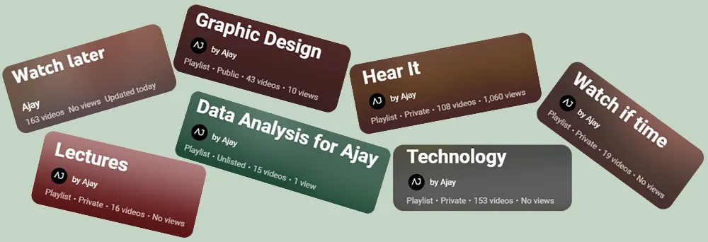

Read on [Medium](https://medium.com/@ajaytshaju/how-ai-can-be-dangerous-to-youtubers-but-helpful-to-viewers-d575310d76f9)

If you’re like me, who puts 200+ videos on different YouTube playlists and does not find time to watch them but your mind does not allow you to remove them, then this blog is for you.

<!-- truncate -->

This is an experiment I've been doing for a while. It's working for me. If you find this helpful or find any problems, please comment.

Let's come to the point

This blog is about **asking an AI to review a video and give answers to our questions.**

My video chat with Gemini

I used Google’s AI **Gemini** (previously Bard) to help me get what’s inside a video using the _video link and a question_. I am sharing it here to show the time reduction when I watch the videos on YouTube vs asking Gemini.

The Idea of asking an AI about a video came from the video title itself. For example, a hypothetical title “You need to stop using this in your Python code” — when I see this title + video thumbnail, the first question that comes to my mind is “What is that one thing I need to stop using in my Python code?” and YouTubers expect people will suddenly click the video to see what it is. This thinking is not wrong, but for a busy person like me 😌, direct clicking and watching on the spot is not possible, and the video will be added to watch later, then it will stay on the list for many months, still having the curiosity to know what’s that one thing. So, in this kind of situation, a tech lover like me will turn to AI to get the answer. While it justifies my act of using AI in this situation, we lazy humans tend to take shortcuts even if they aren’t required. That’s when AI becomes a bane to some people (here YouTubers).

Note: This is not a full-fledged experiment; I am just sharing what I have done and how it saved me time.

Before getting started with anything, I will give you an idea: _“The Answers from AI depend on your Prompt — What You Ask, You Get.”_

### Why am I doing this?

I have more than 200 videos in my YouTube playlist ‘Watch Later’, 156 videos on another custom playlist named ‘Hear It’ (videos to be heard), and 55 videos on another custom playlist named ‘Watch If Time’ (videos where I need to put more effort into watching and doing it side by side). So I planned to go through all the videos in ‘Watch Later’ to see if I could remove any of those videos and ended up removing only 2 videos. My playlists have more informative videos rather than entertainment videos.

videos in my watch later after removing watched videos

Now, let’s dive (ChatGPT vocab) into the details.

Experiment Details:

Number of Videos: **18 videos**
Video Languages: **English and Malayalam** (16 English and 2 Malayalam)
AI Used: **Google Gemini 2.0 Flash** (As it has good integration with Google services)

Time Details:

If I watch all the videos at 1x speed, then it would take about 5 hours and 18 minutes, but if I watch those videos at 1.5x speed then it would take only 3 hours and 30 minutes. Things turned around when I used the above explained AI method and put a stopwatch to record the time taken — it took me only 1 hour and 24 minutes, where this 1.5 hour included me taking the links of the videos, making questions in my mind, taking notes of Gemini answers, writing down ideas for this blog, etc. If I calculate the time taken for copying the link, making the questions, and getting the answers from AI, it would take only around 45 to 50 minutes. Therefore, I can say I got the answers I was searching for in those videos in just 1 hour rather than 5.3 hours.

In short:

Total length of watching all videos in 1x speed: **5 hours 18 minutes**
On watching in 1.5x speed: **3 hours 30 minutes**
With Gemini AI: **1 hour**

Getting started:

Opened all videos to different chrome tabs; Went to each video, copied the link; Made the question and asked to Gemini

Videos opened on multiple tabs

Now, with this information in hand, let's explore the good and bad sides of this technology, both from users' and video makers’ perspectives.

### How does this help users?

- Direct answer for your questions. You will save a lot of time than watching the videos and ADs YouTube throws on you.
- Videos may skim through some topics, but on asking an AI, most of the time you will get structured answers and some proper words or phrases that can be used while you are transferring your knowledge in a discussion, interview, or even a casual talk.
- Help filter out unwanted information — take only what you need, for example: the video “7 Best AI Tools You NEED to Try in 2025 (Free & Powerful!) 💡” by [Kevin Stratvert](https://www.youtube.com/@KevinStratvert) has listed tools like Zapier, Google AI studio, ChatGPT, Udio, ElevenLabs, Perplexity, and Descript — out of these AI tools, Udio was the only one new AI tool for me, so why should I spend 7 minutes and 48 seconds watching his video which costs around 100 to 300 MB of data when I can ask Gemini using the video link and my question and get the answer all within 2 minutes.

Now a little Surprise

I gave Gemini a link to a **Malayalam video**, which I previously watched; as a surprise to me, it replied with an exact answer. But how has Gemini given answers for a Malayalam video? I tried to make an answer, as I am in the domain of AI and Data Science.

The first answer that came to my mind is that it took some English words the narrator used and collected all the words to give me the answer. But this will give only a surface idea which is not enough, so I though something else, which can be told with a hypothetical situation — Imagine/remember you listening to two other people talking their language which you don’t know, but they use a language you know (example English) in between, in such scenario you won’t get complete idea, but understands what topic they’re discussing and in what way the talk is going (Positive, Negative, Neutral etc). This is exactly what happened in Gemini.

I also asked Gemini to answer how it understood the Malayalam video and provided me with an exact answer. See Gemini’s reply

> _I analyze videos using audio processing, visual cues, and contextual understanding. Even without translation, I detect English keywords, filmmaking terms, and on-screen text. Visual analysis helps me grasp settings, characters, and events. My broad film knowledge and pattern recognition allow me to infer meaning from expressions, scene changes, and common storytelling structures. This combination helps me summarize key themes even in languages I don’t fully understand._

### What do we miss?

* Visual Demonstration: Videos like “30 Must-Know English Idioms for Fluent Conversation!” by POC English — his acting and graphical illustrations, subtitles with highlights are missed when I am chatting with an AI about the video.

* In Coding videos, if you’re a beginner, it is better to see the instructor coding and trying to do it in parallel with the video. But if you’re a professional and just need the core idea to feed your FOMO, then AI is your friend.

* The storytelling style, hand and body gestures, and in-depth explanations of Why, What, How, When, etc, are missed, especially the videos from channels like Veritasium.

* Audio nuances like the tone of voice, emphasis, pace, etc, which convey important information and transfer emotion like humor, sarcasm, anger, and tension, which are difficult to express in text, are missed.

* A video may not be only about the core idea or a term, but it will have useful information in the introduction and conclusion. Gemini like AIs will give only ‘what you asked for, ’ so your questions (prompting) matter.

* Also, videos may also give you an experience of discovery — you may get stuck at any unexpected information, then you will be doing a search to find it, during which you get stuck in some ideas and create something new out of it, or even conceive a new idea.

* Potential for Misinterpretation: We need to remember that these AI systems are still an ‘under-development’ project but a working in most cases, and the LLM providers give a warning about their answers. See the image below.

Warning on using AI

### How can it affect video makers/YouTubers?

* Reduced Watch Time: When we use AI, naturally, there will be a decrease in watch time. Watch time is an important metric for YouTube’s algorithm, important for video visibility and monetization. If more viewers use AI summaries instead of watching the videos, creators will end up with watch time troubles.

* Engagement Metrics: If a normal viewer likes the video, then they will give a thumbs up, but I don’t think AI users will come back and give thumbs up when using AI. What I do is take time to come back and give a like or comment to respect the creator’s hard work. Also when I am taking the link and asking questions to AI, the video will be playing in the background, so it will give the view too.

* Audience Connection: When many audiences go for AI shortcuts, getting a creator-viewer relationship will be much harder. Also, watching videos allows viewers to connect with the creator’s personality, style, and message in a way that summaries cannot replicate. This connection increases loyalty and encourages viewers to return for more content.

* Ad Revenue: For all YouTubers, money will be one of the aims and is important, too. If the above explained things happen at a huge rate, then it will affect monetization of the creator.

* YouTube’s new update: While I was taking a link of a video, I saw a similar thing to what I was doing, its none other than “AI Summary of the Video directly on YouTube.”

AI video summary on YouTube

By now, regardless of you being a YouTuber or not, you will be thinking — How can someone become Gemini(AI)-proof?

A pause!

I was thinking through different methods, and asking AIs to give some ideas 😎 I ended up feeling that it’s impossible to completely “Gemini(AI)-proof”, but there is ground for correction — so you the reader might have some ideas, so store it in your mind or a paper, read my suggestions and if your idea is not listed then come, be a part of making humans AI proof.

Now, see some strategies:

* Interesting Content: When I see some posts on LinkedIn or Instagram, on reading that I would press the like button multiple times and re-read the post. This kind of curiosity-raising and interesting videos should be created, which makes the viewer watch the video again and again.

* Visual Storytelling: Out of the 18 videos taken into the experiment, plus all the other videos I handed over to AI, they have something in common. It's none other than FACTS. I look for facts so as similar viewer like me. Videos need to have some facts, but on top of facts, there should be visuals, animations and whatever thing that can make viewer engaged with the video. One should say we have to watch his/her videos. Some examples that come to mind are [Branch Education](https://www.youtube.com/@BranchEducation), [Neo](https://www.youtube.com/@neoexplains), [Fern](https://www.youtube.com/@fern-tv), [3D Living Studio](https://www.youtube.com/@3DLivingStudio), [Jared Owen](https://www.youtube.com/@JaredOwen), etc.

* Demonstrations: If your video involves a process, show it clearly. Don’t just describe it with engaging visuals like animations, graphics, and B-roll footage to keep viewers visually engaged.

* Dynamic Editing: Keep the pace moving with cuts, zooms, and other editing techniques.

* Emphasize Audio Nuances: Use tone of voice, emphasis, and pacing to convey emotion and keep viewers interested. Incorporate music, sound effects, and ambient sounds to create a richer audio experience.

* Go Deep on Topics: Provide in-depth explanations, examples, and context that are difficult to summarize. Offer original perspectives and analysis that viewers can’t find elsewhere. Tackle complex subjects that require a longer, more detailed video to fully understand.

### What’s next?

I have a ton of open tabs in my Google Chrome, both on mobile and laptop. Most of them are to be read, related to developments and topics in AI & DS and some geo-politics.

Recently, I noticed a weird thing appearing on the tab count placeholder in Google Chrome Mobile App, it was **:D**. At first, I thought it was a bug in Chrome, but when I read and closed some tabs, I saw number 97 as the tab count. I tried adding three more tabs and saw the symbol again, and when I searched for the meaning of :D, it was a big smile emoji 😃.

99 tabs and 100 tabs in Google Chrome

Now, it’s time to tackle the problem of too many tabs in Chrome. Until I find a quick solution, a short bye 👋

Before leaving, please clap and share this story if it adds value.