# Bash to Fish: A Terminal Change

<!-- ---
title: Changelogs in Pull Requests
--- -->

I found the name **Fish Terminal** funny the first time I heard it. When I came to know about the full form of ***Fish, Friendly Interactive SHell***, I felt it was a good decision of [fish maintainers](https://github.com/fish-shell/fish-shell) putting the name as Fish, and the full form carries a heavy meaning too. I love the names of open source technologies, especially the acronyms they use — terminal names like Bash (Bourne Again SHell), Fish, Zsh (Z Shell) are very appropriate to them.

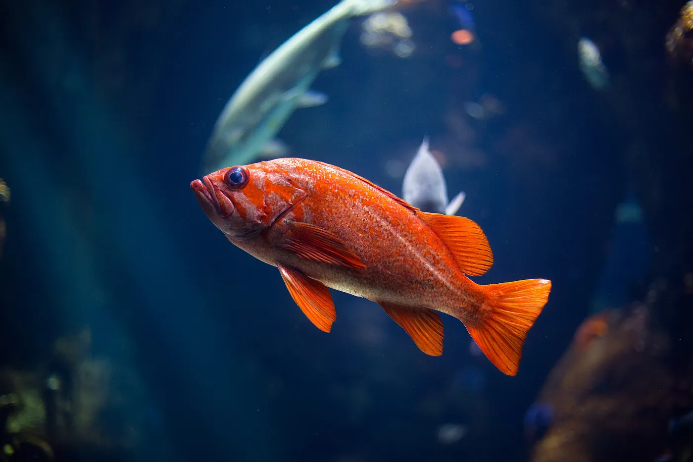
Photo by [Claudio Guglieri](https://unsplash.com/@claudioguglieri?utm_source=medium&utm_medium=referral) on [Unsplash](https://unsplash.com/?utm_source=medium&utm_medium=referral)

Whether it is the workplace or home, I use Linux a lot, and the terminal is the first thing I open and the last to close. Whether it’s managing conda environments, SSH to remote servers, or running Python scripts— I live inside the terminal. For years, I used bash by default. Not because I loved it, but it comes with Ubuntu.

Last month, until a workday’s afternoon I typed many things like making activating and deleting many conda envs, scripting running python codes of varying lengths, ssh to different servers and setting up some docker containers and other services, after all the long typings my knuckles are so sore that I cannot fold them easily to hold the spoon to eat something, so as a first move to resolve this, my manager bought a new Logitech wireless keyboard for me, and it solved 50% of typing issues. But what about the remaining 50%?, That was filled with me writing repetitive commands of conda, long commands for Docker, and making Python scripts; frustrated and tired of this, I searched for a good terminal. Why? because “I live in the terminal” and found [Fish Shell](https://fishshell.com/). This post is all about my experience with fish shell, what things got easier, what improved, and how I use it, etc...


Finger pain due to typing, photo from [this](https://www.jonathanshultsmd.com/blog/can-typing-cause-carpal-tunnel-syndrome) website

### Why I looked beyond bash

Bash is stable and battle-tested, no doubt. But it also feels stuck in time. It doesn’t help you much. You have to remember everything. Tab completion is limited, no autosuggestions, no visual hints, and nothing that tells you you’re typing the wrong path or missing a command. I started noticing how much time I was spending retyping things, checking history, running `ssh` manually to the same servers, or typing `conda activate some_env_name` again and again.
Getting started with Fish Shell (without extra effort)

I installed Fish through Bash with some simple commands

    sudo apt-get update && sudo apt-get upgrade

    sudo apt-get install fish

Fish just worked out of the box. No need for any config files, setting paths, or anything. Just type `fish` on your bash to get started with fish shell.

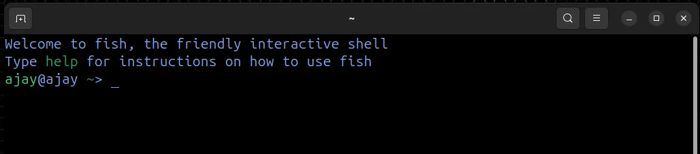
Fish shell on first launch

Now, instead of going through the features of the fish terminal, I'm jumping to the customization options — I changed the theme, prompt style, and default greeting message to `Welcome AJAY!`, but only for a week.

To customize Fish shell, just type `fish_config` on the fish terminal and it will automatically display a browser window having all the configurations that can be done on the fish terminal.

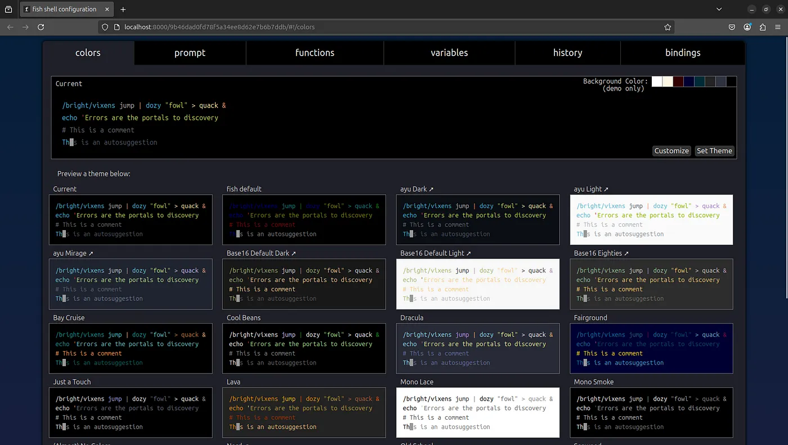
fish_config browser UI

But in my home computer, when I type fish_config, it tries to open a temporary HTML file that doesn’t open in the browser, but don’t worry, just go to the same terminal and you can see a localhost link, ctrl + right click that link to get it opened on your browser.

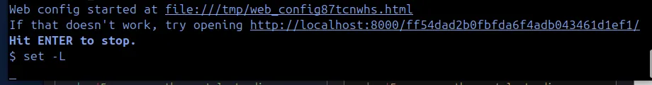
Fish Config

From this browser page, you can change `terminal color` , `prompt style`(_ajay@ajay_ ~>, in the first fish shell image) and see different fish functions and key bindings. Just change to whatever setting you like, and press `set prompt/color/theme`, close the browser tab, come back to the terminal, and hit the Enter key to stop configuring and saving the changes.

#### Changing the greeting message

The greeting message seems to be very welcoming when we use the terminal once or twice a week, but it may not be when you use it 24/7. So, to erase the greeting message type `set fish_greeting` and hit Enter.

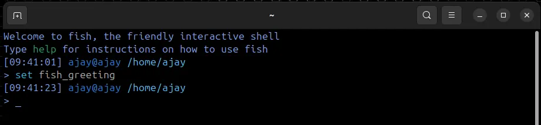
Turn off fish greeting

Now `clear` the terminal to see a terminal without a greeting message. But this is temporary, in the next session of the terminal, the greeting message will appear again.

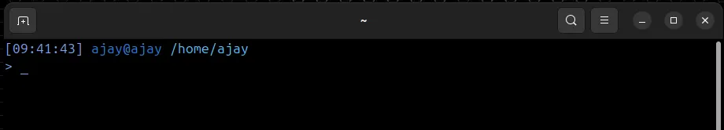
terminal without greeting message

You can permanently erase the greeting message/put a custom greeting message in the terminal by editing the `fish_greeting.fish` file located at `/usr/share/fish/function/fish_greeting.fish`.

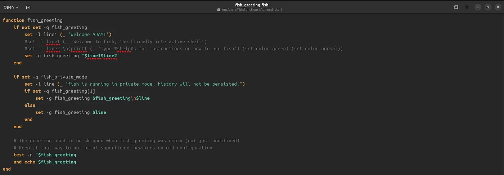
Edit fish_greeting function for displaying custom greeting message

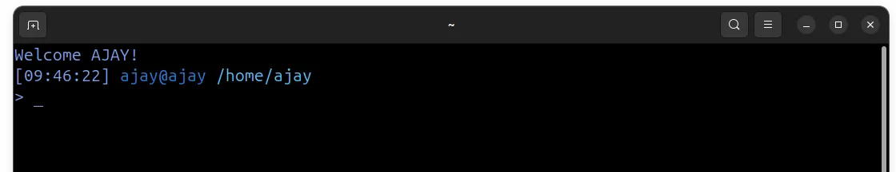
My custom greeting message

You can see the function definition while opening `fish_config` on browser, it can be used to find the location of that script too (first line in red color).

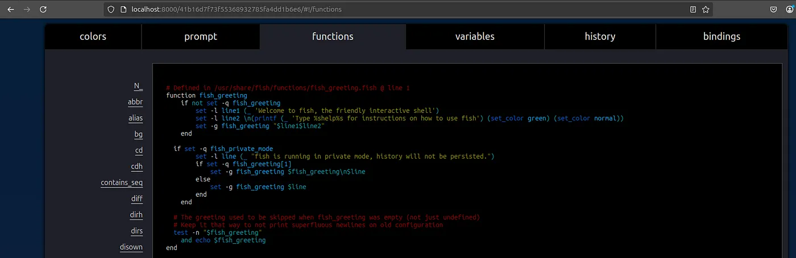
Fish function in functions tab on fish_config

### Features of Fish Terminal

* **Autosuggestions**: Fish suggests commands based on your command history, which you can see using `history` command.

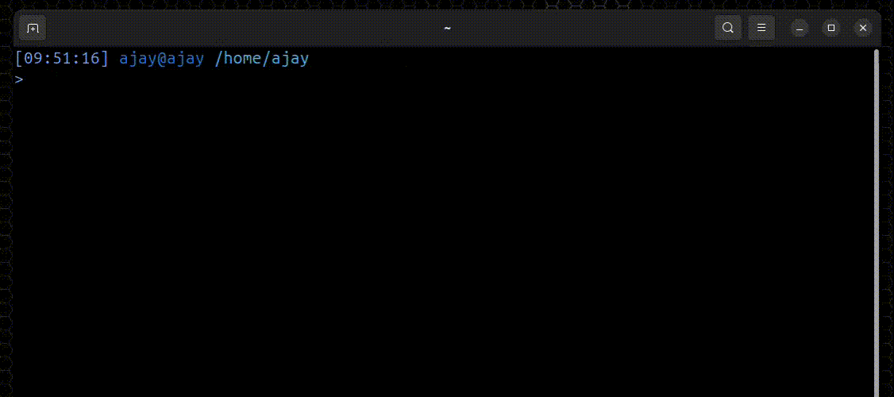
Autosuggestion in Fish Terminal

You can either press `right arrow` or `Ctrl+F` to accept the auto suggestions. `Tab` press is similar to bash, if there is only one command as result, then tab will complete it, else it will display all the possible commands.

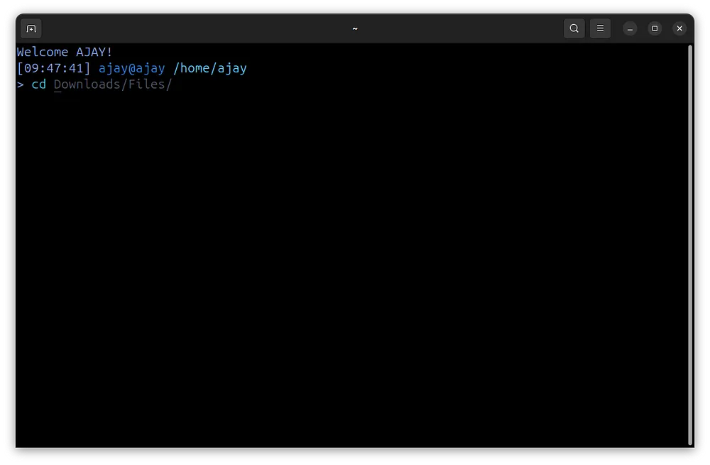
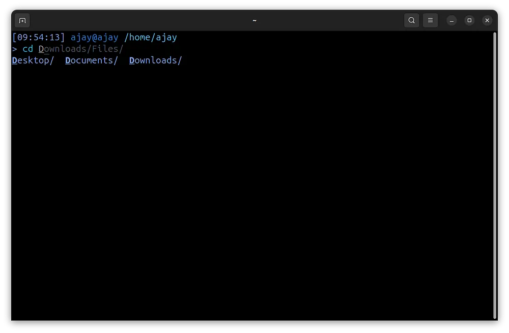
Autosuggestion and tab-press output

* **Syntax highlighting**: Wrong commands turn red. You fix them before running. In the GIF below, when I type `nvidia-si` the command got a red color, which means I typed the wrong command.

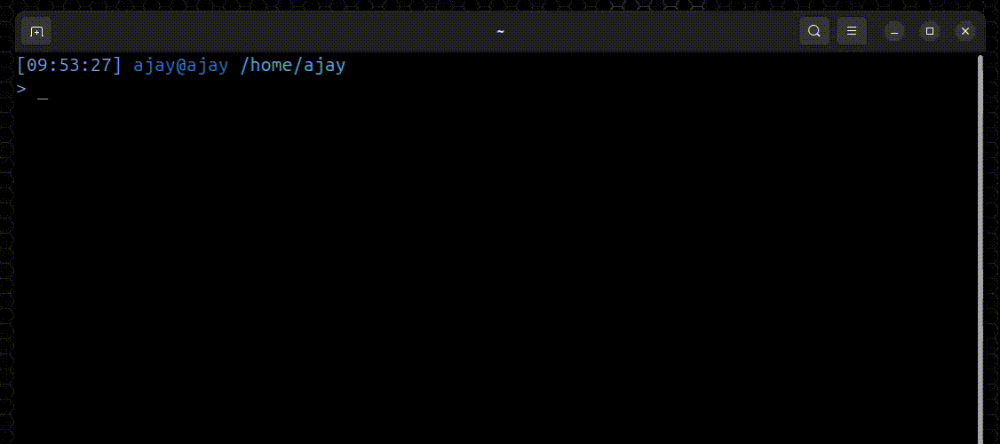
Syntax highlighting in Fish

* **Abbreviations**: You can set custom acronyms for long commands, and they will be expanded when you press the Spacebar or Enter.

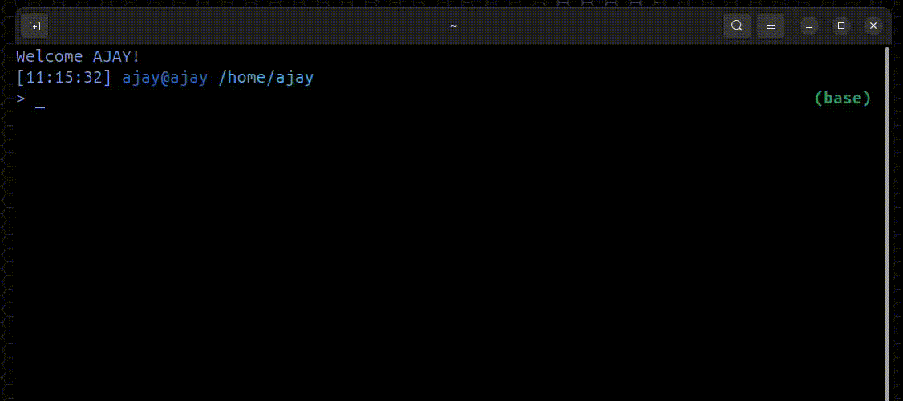
Abbreviation in Fish

Typing `ca nlp` becomes `conda activate nlp` in the terminal before hitting Enter. Likewise, you can make as many as you want.

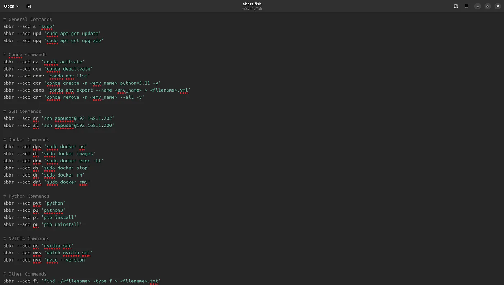
List of abbreviations I am using

By seeing the above list, the first thing you might think would be — how is this guy able to remember these many short forms, when learning these commands itself is a headache.

The answer is that I don’t have any special ability to remember all these shortened commands; I remember the most-used 10–15 commands. And all the commands are printed on paper and kept next to me all the time.

The next question will be, “Am I able to take out and use these short forms when I use other fish terminals in some other place?” Absolutely yes! All the short forms from the fish are stored in a file `abbr.fish` you can take that file or copy its contents to use it anywhere.

* **Math/Calculator in Shell**: You can do some amazing calculations with fish shell, all the way from `2+2` to `cos()` and more.

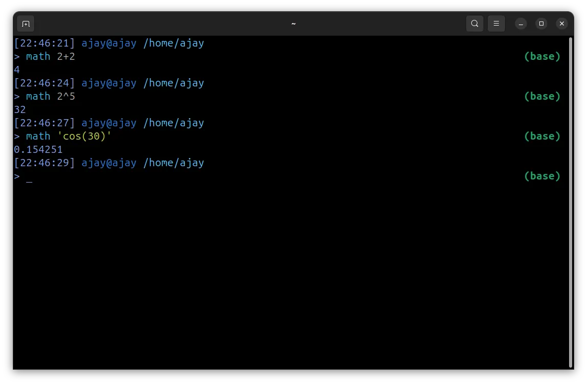
Math in Fish

Just type `math` followed by your math question. And get an instant answer. Using it for a while, I feel opening the calculator and doing some addition/division is a complete waste of time, but fish solve this problem effortlessly. You can learn the power of Fish Math on their dedicated math page here.

* **`count` command to count the number of files**: I usually count the number of files in a directory using the bash command `ls | wc -l` to decide which command to use for an operation. For example, if a directory contains 20 files, then we can do GUI-based delete/copy-paste/zip operations. But what if it contains 200,000 files or even 20,000,000 files? In this case, if you use GUI-based operations, it will take multiple days to finish, so you have to switch to the terminal and use efficient commands like `parallel, pigz, dd etc…`. While performing the count operation using ls, cdcommand through different directories, you will waste a lot of time by typing the commands, but `count` in the fish terminal is much easier to use.

* **Search through commands using `Ctrl+R`**: I always look into `history` command to get some long/repetitive commands and copy-paste them to save time. For example, `history | grep ssh` to search for the ssh command I use every time, which is far above to reach with the up arrow (navigating the command history). There might be some way to do this in other terminals, but it won't be as interactive as Fish.

;%20Part%20of%20command%20I%20remember%20(right)1.webp)
;%20Part%20of%20command%20I%20remember%20(right)2.webp)
Using correct command (left); Part of command I remember (right)

Just press `Ctrl+R` and search for the command you need. In addition to this, Fish supports Fuzzy Searching too, so you just type whatever you remember about the command you’re looking for, Fish will find it for you in a blazing fast way.

So these are the features of Fish I love and use every time. In the coming week I will be dedicating some time to explore other commands like `random, bg, argparse etc…` If you want to explore all the abilities of Fish Terminal yourself, just visit this [command page](https://fishshell.com/docs/current/commands.html).

If you liked this much (fish=continue reading; story=quick clap) then we can set Fish as the default terminal, so that you can use Fish as soon as you launch the terminal.

```mdx
    which fish — displays the path/location of fish executable

    sudo chsh -s <which fish output here>

    or do both together

    sudo chsh -s `which fish`
```

### Problems and solutions

Whenever you use a technology, there will be some issues. _When you solve that issue, it will make you closer to that tech, and you will start to love it more and more_. I think it is due to the `kick` we get from solving the issues. So the problem

* Conda didn’t work inside Fish

When I typed `conda` it shown `command not found error`


conda not found in fish

I fixed it by

```mdx
    nano ~/.config/fish/config.fish — opens fish config file

    set -gx PATH /your/path/to/conda/bin $PATH — Conda Bin path, in my case it was in $HOME/anaconda3/bin

    conda init fish — similar to conda init in bash

    source ~/.config/fish/config.fish — restart the shell or you can log out and log in

    conda activate <any conda env name> — testing
```

;%20Setting%20path%20to%20that%20directory%20(right)1.webp)

;%20Setting%20path%20to%20that%20directory%20(right)2.webp)
Locating Conda Bin directory (left); Setting path to that directory (right)


### Finally

Switching to fish didn’t feel like changing my workflow. It just removed friction. I still run the same commands, ssh into the same servers, and activate the same environments. But now I do it faster, with fewer typos, and less mental overhead. If you use the terminal for most of your work, give Fish a try. You’ll know by then whether it’s for you or not. For me, I’ve already made it my default shell at home and work.

Now I am looking forward to more possibilities of Fish, an upgrade to the terminal code editor (currently using nano).

So that's it. Thank you for reading!