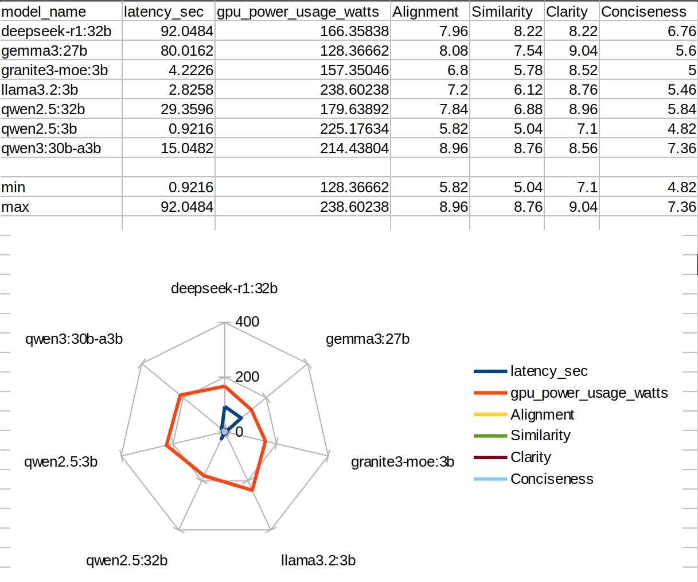
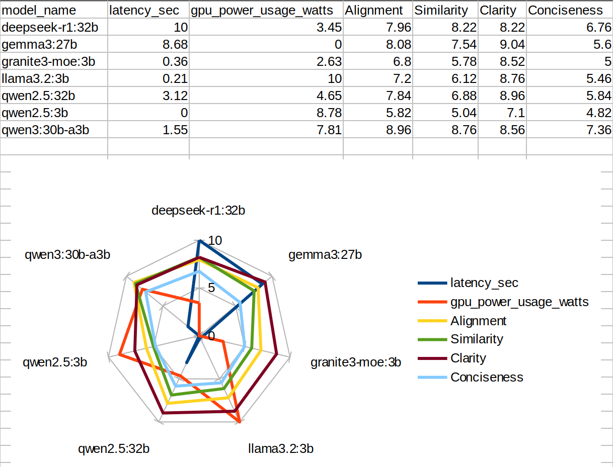

I was working with some LLMs, and I need to compare a set of LLMs based on metrics like `Latency, GPU Power Usage, Alignment, Similarity, Clarity, and Conciseness` for 9 Open Source LLMs. So I thought `Spider/Radar Chart` would be the best to show the comparison in a single graph. On plotting my data directly I got


Before Normalizing

See, the scaling of my data was wrong, as `Alignment to Conciseness` was scaled between 0-10 and the other two has no standard scaling. So I need to bring the `Latency and GPU Power Usage` values between 0 to 10. So the solution was `Min-Max Normalization`.

$$
\begin{gather*}
Min-Max\;Normalization=\left[\frac{(x−min(x))}{(max(x)−min(x))}\right] \times (new\_max - new\_min) + new\_min\\

\hspace{-5.3cm} min(x) \; \text{is the minimum value in the data range to be scaled} \\
\hspace{-5.2cm} max(x) \; \text{is the maximum value in the data range to be scaled} \\
\hspace{-6cm} new\_min(x) \; \text{is the min value of new scale (0 in [0, 10])} \\
\hspace{-5.7cm} new\_min(x) \; \text{is the max value of new scale (10 in [0, 10])} \\
\end{gather*}
$$


After Normalizing

Now an Example:

We have values `[23, 37, 11, 76]` and the requirement is to scale it between 0-10, i.e, $min(x) = 11,\; max(x) = 76,\; new\_max = 10,\; new\_min = 0$

$$
\begin{gather*}
\text{Equation becomes:} \\
\\
\Longrightarrow \left[\frac{(x−11)}{(76−11)}\right] \times (10 - 0) + 0 \\
\\
\Longrightarrow \left[\frac{(x−11)}{(65)}\right] \times 10
\end{gather*}
$$

Now we can put all the x(s) and get the `min-max normalized` values

|Real Values | New Values |
| :---: | :---: |
|  23   |  1.8  |
|  37   |   4   |
|  11   |   0   |
|  76   |   10  |

Python Code Snippet for Min-Max Normalization:

```python
normalized = ((values - old_min) / (old_max - old_min)) * (new_max - new_min) + new_min
```

---

## Normalization vs Standardization vs Scaling

| Concept             | Definition                                                     | Formula                                 | Range            | Use Case                                                       |
| :-------------------: | :--------------------------------------------------------------: | :---------------------------------------: | :----------------: | :--------------------------------------------------------------: |
| **Normalization**   | Rescales values to a fixed range (usually \[0, 1] or \[0, 10]) | $\frac{x - \min(x)}{\max(x) - \min(x)}$ | Any range        | Visualizations, ML when scale matters (e.g., KNN)              |
| **Standardization** | Centers data around mean 0 and standard deviation 1            | $\frac{x - \mu}{\sigma}$                | Mean = 0, SD = 1 | When data is Gaussian, or algorithms assume zero-centered data |
| **Scaling**         | Generic term – includes both normalization and standardization | N/A                                     | N/A              | Any transformation to bring values into a defined scale        |
